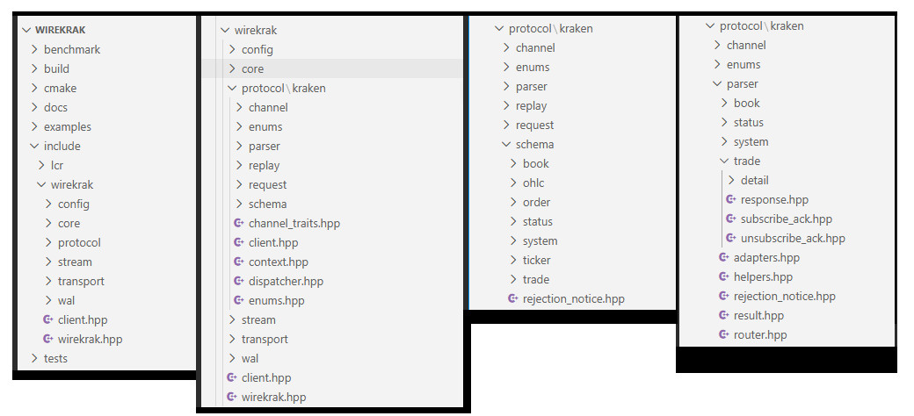

# Wirekrak ⚡  
**A High-Performance WebSocket SDK for Real-Time Kraken Trading**

Wirekrak is a modern C++ WebSocket SDK designed for **low-latency, real-time trading applications** on the Kraken exchange.  
It is built with **production-grade architecture**, focusing on reliability, determinism, and extensibility.

> 🚀 Built for the **Kraken Forge Hackathon**

---

## 🧩 Problem Statement

Developers integrating with the Kraken WebSocket API must manage complex, error-prone concerns such as subscription state tracking, reconnect logic, and fragile JSON message handling. Existing solutions often expose low-level streams without strong typing or lifecycle guarantees, increasing the risk of bugs in real-time systems. Wirekrak addresses this by providing a lightweight, strongly typed C++ SDK that abstracts protocol complexity and delivers reliable, deterministic WebSocket interactions.

---

## 🛠️ What I Built

Wirekrak is a lightweight C++ SDK for the Kraken WebSocket API, designed around a clean, layered architecture that separates transport, client policy, protocol handling, and subscription management. The current implementation focuses on **trade and order book subscriptions**, providing strongly typed message handling and deterministic lifecycle management across acknowledgements and reconnects.

What makes it unique is its modular, layered design, which makes the SDK easy to extend with additional channels, transports, or features over time, while maintaining reliability, testability, and scalability. This makes Wirekrak well suited as a foundation for production-grade trading and market-data systems.

---

## ✨ Core Features

## 1️⃣ Schema-First, Strongly Typed Protocol Design

Wirekrak uses a **schema-first architecture** for all Kraken WebSocket messages.
- Strongly typed request, response, and event models
- No fragile string-based JSON handling
- Compile-time safety for channel payloads
- Clear separation between schema definition and transport

➡️ This dramatically reduces runtime errors and improves developer confidence.

## 2️⃣ Modular WebSocket Transport Abstraction

The SDK cleanly separates WebSocket transport from protocol logic.
- Protocol-agnostic transport interfaces
- Current implementation using Windows WinHTTP WebSocket
- Easy to extend to other platforms (Boost.Asio, libwebsockets, etc.)
- Fully mockable for testing

➡️ This makes the SDK portable, testable, and future-proof.

## 3️⃣ Kraken-Specific Protocol Layer

A dedicated protocol layer tailored to Kraken WebSocket API.
- Typed channel traits for Kraken subscriptions
- Explicit routing of incoming messages
- Clear validation of protocol correctness
- Clean mapping from raw messages → typed events

➡️ This avoids generic “one-size-fits-all” SDK design and shows deep API understanding.


## 4️⃣ Liveness Detection & Connection Health Monitoring

The SDK includes built-in liveness detection mechanisms.
- Detects stalled or dead WebSocket connections
- Supports heartbeat/ping-based validation
- Enables safe reconnection strategies
- Fully covered by unit tests

➡️ Essential for real-time trading reliability.

## 5️⃣ Deterministic, Test-Driven Architecture

Wirekrak is backed by extensive automated tests across all layers.
- Protocol validation tests
- Transport behavior tests
- Liveness detection tests

➡️ Demonstrates engineering maturity, not just a prototype.

## 6️⃣ Clear Separation of Concerns (Clean Architecture)

The SDK follows a strict architectural split:
- Transport — WebSocket connectivity and failure signaling
- Client Policy — reconnection, liveness
- Protocol — Kraken message schemas, subscriptions and routing

➡️ Enables deterministic testing, clean failure handling, and future multi-exchange support.


**Wirekrak** is not just a WebSocket client SDK, but a foundation for building reliable, replayable, and testable real-time trading and market data systems in modern C++.

---

## 🧱 Architecture Overview

Wirekrak is structured in several independent layers that allows deterministic testing, clean failure handling, and future support for additional exchanges or transports.

```
wirekrak/
├── transport/                       # Protocol-agnostic WebSocket interfaces
├── stream/                          # Client Policy — reconnection, liveness
├── protocol/kraken/                 # Kraken-specific protocol handling
             ├── schema/             # Strongly typed Kraken message schemas
             ├── parser/             # Modular message parsing layer
             ├── channel/            # Channel subscription manager
             ├── replay/             # Deterministic subscription replay engine

```




### Threading Model <a name="threading-model"></a>

Wirekrak currently uses a deliberate **2-thread architecture** optimized for
low latency and correctness. A 3-thread model (dedicated parser thread) is
planned but intentionally postponed until full benchmarking is completed.

➡️ **[Read the full threading model rationale](docs/notes/ThreadingModel_2T_VS_3T.md)**

---

### Transport Architecture <a name="transport"></a>

- Transport is fully decoupled from protocol logic via C++20 concepts
- WebSocket and WinHTTP APIs are modeled as compile-time contracts
- Enables mocking, testing, and reuse with zero runtime overhead

➡️ **[Transport Overview](docs/architecture/transport/Overview.md)**

---

### Stream Client <a name="stream-client"></a>

Wirekrak is built on top of a transport-agnostic, poll-driven stream client that manages WebSocket lifecycle, liveness detection, and reconnection independently from any exchange protocol.

The stream client uses an explicit state machine and dual-signal liveness checks (messages + heartbeats) to provide robust reconnection behavior without background threads or async runtimes. On reconnect, transports are fully destroyed and recreated to avoid undefined internal state.

This design provides a deterministic, reusable foundation for exchange SDKs, real-time market data pipelines, and low-latency trading systems.

➡️ **[Stream Client Overview](docs/architecture/stream/StreamClient.md)**

---

### Kraken Streaming Client <a name="kraken-client"></a>

Wirekrak includes a dedicated **Kraken WebSocket v2 client** built on top of the generic stream layer.
It exposes a protocol-oriented, type-safe API for subscribing to Kraken channels while fully
abstracting transport, liveness, and reconnection concerns.

The client uses an ACK-based subscription model with automatic replay on reconnect, explicit polling,
and strongly typed message dispatch. This design enables deterministic behavior and clean integration
with trading engines, analytics pipelines, and real-time systems.

➡️ **[Kraken Client Overview](docs/architecture/protocol/kraken/KrakenClient.md)**

---

### Low-Latency Parser, Protocol-Strict <a name="parser"></a>

Wirekrak includes a production-grade WebSocket parser designed for real-time market data. It uses schema-strict validation, constexpr-based enum decoding, and zero-allocation parsing on top of simdjson.

The architecture cleanly separates routing, parsing, and domain adaptation, enforcing real exchange semantics (e.g. snapshot vs update invariants) and rejecting malformed messages deterministically.

#### Parser Router

Incoming WebSocket messages are first routed by method/channel to the appropriate message parser, ensuring each payload is handled by the correct protocol-specific logic with minimal branching.

#### Layered Parsers (Helpers → Adapters → Parsers)

Low-level helpers validate JSON structure and extract primitives, adapters perform domain-aware conversions (enums, symbols, timestamps), and message parsers handle control flow and logging. This separation keeps parsing fast, safe, and maintainable.

#### Explicit Error Semantics

Parsing distinguishes between invalid schema and invalid values using a lightweight enum, allowing robust handling of real-world Kraken API inconsistencies while remaining allocation-free and exception-free.

```note``` Every parser is fully unit-tested against invalid, edge, and protocol-violating inputs, making refactors safe and correctness provable.

```Built as infrastructure, not a demo.```

➡️ **[Parser Overview](docs/architecture/protocol/kraken/JsonParser.md)**

---

### Message Dispatcher <a name="distpatcher"></a>

The Dispatcher delivers decoded Kraken messages to user callbacks based on symbol and channel, using compile-time channel traits and symbol interning.

Key features:
- Zero runtime channel branching
- Strong compile-time guarantees
- Multiple listeners per symbol
- Extremely fast dispatch path

➡️ **[Dispatcher Overview](docs/architecture/protocol/kraken/DispatcherModule.md)**

---

### Subscription Manager <a name="subscription-manager"></a>

The Subscription Manager is responsible for deterministic tracking of trade and order book subscriptions for the Kraken WebSocket API. It manages the full lifecycle of subscription and unsubscription requests, ensuring that subscriptions transition correctly between pending and active states only after explicit server acknowledgements.

The manager supports Kraken’s multi-symbol subscription model by grouping symbols under a single request ID and tracking partial acknowledgements safely and efficiently. It maintains separate state for pending subscriptions, pending unsubscriptions, and active subscriptions, allowing the client to recover cleanly from reconnects by replaying only confirmed active subscriptions.

➡️ **[Subscription Manager Overview](docs/architecture/protocol/kraken/SubscriptionManager.md)**

---

### Subscription replay <a name="subscription-replay"></a>

The **Replay Module** is designed to support resilient WebSocket-style subscription handling in a lightweight SDK client.
Its primary responsibility is to **record subscription requests** and **replay them automatically on reconnection**,
ensuring continuity after transient network failures.

➡️ **[Subscription Replay Overview](docs/architecture/protocol/kraken/SubscriptionReplay.md)**

---

## ✨ Liveness Detection

Wirekrak uses dual liveness detection: protocol heartbeats and real message flow.
Reconnection only occurs when both signals stop, preventing false reconnects during quiet markets.”

### Heartbeats monitoring

Wirekrak actively monitors protocol heartbeats.
If heartbeats stop beyond a configurable timeout, the client
assumes the connection is unhealthy and signal it to reconnect.

### Messages monitoring

Wirekrak actively monitors protocol messages. If last received message timestamp is greather than
a configurable timeout, the client assumes the connection is unhealthy and and signal it to reconnect.

---

## 📡 Telemetry Overview <a name="telemetry"></a>

Wirekrak provides **compile-time, zero-overhead telemetry** designed for low-latency and infrastructure-grade systems.

Telemetry is:
- observational only (never affects behavior)
- fully removable at compile time
- safe for latency-critical paths

### Telemetry Levels

| Level | Description | Default |
|------|------------|---------|
| **L1** | Mechanical metrics (bytes, messages, errors, message shape) | **ON** |
| **L2** | Diagnostic metrics (deeper timing and pressure insight) | OFF |
| **L3** | Analytical metrics (profiling, tracing, experimentation) | OFF |

Higher levels automatically enable lower ones.

### Enabling Telemetry

```bash
-DWIREKRAK_ENABLE_TELEMETRY_L1=ON
-DWIREKRAK_ENABLE_TELEMETRY_L2=OFF
-DWIREKRAK_ENABLE_TELEMETRY_L3=OFF
```
When disabled, telemetry is completely compiled out.

➡️ **[Tlelemetry Level Policy](docs/architecture/TelemetryLevelPolicy.md)**

---

### Low-latency Common Resources (`lcr`)

Wirekrak includes a small internal utility layer named **LCR** (Low-latency Common Resources).

`lcr` contains reusable, header-only building blocks designed for
low-latency systems and used across ULL systems, including:

- lock-free data structures
- lightweight `optional` and helpers
- bit-packing utilities
- logging abstractions

These utilities are **domain-agnostic** (not Kraken-specific) and are intentionally kept separate
from the Wirekrak protocol code to allow reuse across other ULL (Ultra-Low Latency) projects.

Wirekrak itself depends on `lcr`, but `lcr` does not depend on Wirekrak.

---

## 🚀 Getting Started

### Prerequisites

- C++20 compatible compiler
- CMake ≥ 3.25
- Windows (WinHTTP transport)

### Installation <a name="installation"></a>

Before building Wirekrak, please install the required dependencies using **vcpkg**.

➡️ **[Install dependencies](INSTALL_DEPENDENCIES.md)**

This guide covers:
- vcpkg setup
- Required libraries (simdjson, spdlog, CLI11)
- CMake presets
- Debug / Release builds

### 🔧 Build

```bash
git clone https://github.com/<your-org>/wirekrak.git
cd wirekrak
cmake -S . -B build
cmake --build build
```

---

## 📡 Example Usage

```cpp
#include "wirekrak/client.hpp"

using namespace wirekrak;

int main() {
    
    // Client setup
    WinClient client;

    // Register handlers
    client.on_pong(...);
    client.on_status(...);
    client.on_rejection(...);

    // Connect
    if (!client.connect("wss://ws.kraken.com/v2")) {
        return -1;
    }

    // Subscribe to BTC/USD trades with snapshot enabled
    client.subscribe(trade::Subscribe{.symbols = {"BTC/USD"}, .snapshot = true},
                     [](const trade::Trade& msg) { std::cout << " -> " << msg << std::endl; }
    );

    // Main polling loop
    while (!Ctrl_C) {
        client.poll();   // REQUIRED to process incoming messages
    }

    client.unsubscribe(trade::Unsubscribe{.symbols = {"BTC/USD"}});
    
    return 0;
}

```

```Note:``` Subscribe, Unsubscribe, and Control requests are modeled as distinct types and constrained using C++20 concepts, ensuring request misuse fails at compile time with zero runtime overhead.

---

## 🧪 Running Tests

Wirekrak uses **CMake Presets** and **CTest** for building and running tests.
All test configuration is handled automatically via presets.

### Prerequisites
- CMake ≥ 3.23
- Ninja
- A C++20-compatible compiler

### Configure

**Debug**
```bash
cmake --preset ninja-debug
```

```bash
cmake --preset ninja-release
```

This generates build directories under:

- build/debug
- build/release

### Build

```
cmake --build --preset debug
```

```
cmake --build --preset release
```

###  Run Tests

```
ctest --preset test-debug
```


```
ctest --preset test-release
```

By default, test output is shown only on failure.

### Verbose Test Output

```
ctest --preset test-debug --verbose
```

or:

```
ctest --preset test-debug -VV
```

### Run a Specific Test

```
ctest --preset test-debug -R LivenessTest
```

### Notes

- Tests are enabled via the WK_UNIT_TEST=ON preset option.
- Unit tests cover client liveness detection, heartbeat and message timeouts, and automatic reconnection behavior.
- No external test frameworks are required.

---

## ⚙️ Examples <a name="examples"></a>

### Wirekrak Trades

This example demonstrates how to subscribe to Kraken trade events using Wirekrak, supporting one or multiple symbols,
optional snapshot mode, and clean shutdown via Ctrl+C:

➡️ **[Trade subscription (single & multi-symbol)](./docs/examples/Trades.md)**

### Wirekrak Book Updates

This example demonstrates how to subscribe to Kraken order book updates using Wirekrak, supporting one or multiple symbols, clean shutdown via Ctrl+C, and rejection handling.

➡️ **[Book update subscription (single & multi-symbol)](./docs/examples/BookUpdates.md)**

---

## 🧪 Experimental Integration Examples <a name="experimental-examples"></a>

The examples/experimental/ directory contains opt-in experimental examples that explore advanced or external integrations built on top of Wirekrak.

These examples are not compiled by default and are gated behind an explicit CMake option and preset to avoid impacting normal Debug/Release builds. They may depend on additional code, prototypes, or header-only projects that are intentionally kept outside the core library.

**Enable experimental builds explicitly:**

```
cmake --preset ninja-experimental
cmake --build --preset experimental
```

### ⚡ flashstrike Integration (Experimental) <a name="flashstrike"></a>

Experimental examples demonstrate integration with **flashstrike**, a **high-performance Matching Engine System** built for **ultra-low latency trading**. Optimized for HFT environments, it demonstrates **exchange-grade design principles** in a clean, efficient codebase.

➡️ **[Flashstrike documentation](./docs/flashStrike/README.md)**

The examples highlight architectural interoperability between real-time market data ingestion and a production-grade matching engine design.
Flashstrike is a header-only experimental integration used exclusively by opt-in examples and is not part of the core Wirekrak library.

## Experimental: Kraken → flashstrike Gateway <a name="flashstrike-examples"></a>

Wirekrak includes an opt-in experimental example demonstrating how real-time Kraken level-2 order book data can be fed into a production-grade matching engine.

The example introduces a Gateway layer that normalizes prices and quantities, translates book updates into deterministic limit orders, and injects them into
the flashstrike matching engine. This showcases clean separation between transport, protocol, and execution layers, and mirrors real-world exchange
ingestion pipelines.

➡️ **[flashstrike Gateway Example](./docs/examples/experimental/FlashstrikeMatchingGateway.md)**

---

## 📊 Benchmarks <a name="benchmarks"></a>

Wirekrak includes a growing set of **layered performance benchmarks** designed to
measure isolated system behavior with clear scope and reproducible results.

Benchmarks are organized by subsystem (transport, protocol, stream, end-to-end) and
each lives in its own directory alongside source code, configuration, and documented
observations.

➡️ **[Benchmarks Overview](./docs/benchmarks/README.md)**


---

## ✨ Why Wirekrak

**Wirekrak** is a production-oriented C++ SDK for the Kraken WebSocket API, designed not just to consume real-time data, but to make it reliable, testable, and replayable.

Unlike typical WebSocket wrappers that expose raw JSON streams, Wirekrak provides a schema-first, strongly typed interface that ensures compile-time safety and eliminates fragile string-based message handling. Developers interact with clear, validated data models instead of manually parsing payloads.

The SDK is built on a clean, modular architecture that separates transport, protocol logic, and client policy. This design enables portability, deterministic testing, and future extensibility across platforms or exchanges. Built-in liveness detection and connection health monitoring further ensure stability in real-time environments.

WireKrak’s architecture is designed to support future write-ahead logging and deterministic replay, enabling reliable debugging, backtesting, and simulation workflows beyond live connectivity.

In short, Wirekrak is not just a client SDK—it is a foundation for building serious real-time trading and market-data systems in modern C++.

---

## ⚠️ Notes on Kraken WebSocket Behavior

While testing against the live Kraken WebSocket API, a few minor differences between the documentation and actual behavior were observed.
Wirekrak handles these cases explicitly to ensure reliable operation.

### pong responses

Kraken sometimes sends lightweight pong heartbeat messages without success or result fields.
These messages are valid and indicate a healthy connection.

- Wirekrak accepts both documented and heartbeat-style pong responses.

### Subscribe / Unsubscribe errors

When a subscription request fails (e.g. duplicate subscription), Kraken returns an error-only response with success = false and no result object.

- Wirekrak requires result only on successful responses and correctly parses error replies.

### Book snapshot vs updates

The Kraken book channel delivers a full snapshot followed by incremental updates within the same subscription. Snapshot messages may include undocumented but stable fields (e.g. timestamp), which are treated as metadata and ignored for book logic.

- Wirekrak tolerates extra fields for forward compatibility.

---

## ✨ Acknowledgements

Built with caffeine, curiosity, and a little help from ChatGPT.

ChatGPT was a great brainstorming partner throughout the hackathon, helping explore ideas, refine approaches, and keep the project moving forward.

---

## 📜 License

MIT License

---

## 🤝 Contributing

Contributions are welcome!  
Please open an issue or submit a pull request.

---

**Built with ❤️ for real-time trading**
