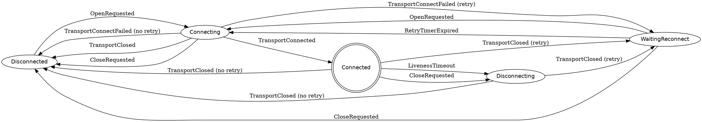

# Connection FSM (Transport Layer)

This document describes the **finite state machine (FSM)** governing  
`wirekrak::core::transport::Connection`.

The FSM models the *logical connection lifecycle* independently of any
protocol, subscription, or exchange semantics.

---

## Design Principles

- **FSM owns all connection policy**
  - retries
  - backoff
  - shutdown resolution
- **Callbacks report facts, never make decisions**
- **Synchronous preconditions are not states**
  - URL parsing and validation happen *before* FSM entry
- **Transport and logical connection are decoupled**
  - the same logical connection survives multiple transport instances

---

## States

| State | Meaning |
|------|--------|
| `Disconnected` | No active transport, no retry scheduled |
| `Connecting` | Transport instance exists, connection attempt in progress |
| `Connected` | Transport is established and usable |
| `Disconnecting` | Graceful shutdown or forced close in progress |
| `WaitingReconnect` | Waiting for retry timer before reconnecting |

---

## Events

### User intent
- `OpenRequested` — user calls `open()`
- `CloseRequested` — user calls `close()`

### Transport lifecycle
- `TransportConnected` — WebSocket connected successfully
- `TransportConnectFailed` — initial connection attempt failed
- `TransportReconnectFailed` — reconnection attempt failed
- `TransportClosed` — WebSocket closed (remote or local)

### Liveness
- `LivenessTimeout` — heartbeat + message inactivity exceeded threshold

### Retry
- `RetryTimerExpired` — backoff delay elapsed

---

## High-level Flow

### Initial connection

1. `open()` validates URL **before FSM**
2. `OpenRequested` → `Connecting`
3. Transport connect attempt
4. Success → `TransportConnected` → `Connected`
5. Failure → `TransportConnectFailed`
   - retry → `WaitingReconnect`
   - no retry → `Disconnected`

---

### Reconnection cycle

1. `WaitingReconnect`
2. `RetryTimerExpired` → `Connecting`
3. Transport reconnect attempt
4. Success → `TransportConnected` → `Connected`
5. Failure → `TransportReconnectFailed`
   - retry → stay in `WaitingReconnect` (with backoff)
   - no retry → `Disconnected`

---

### Liveness enforcement

- Only evaluated in `Connected`
- If **both** heartbeat and message are stale:
  - `LivenessTimeout`
  - transition to `Disconnecting`
  - transport is force-closed
- Closure resolution handled by `TransportClosed`

---

### Shutdown behavior

- `CloseRequested`
  - from `Connected` → `Disconnecting`
  - from `WaitingReconnect` → `Disconnected`
- Local shutdown never retries

---

## Invariants

- `parsed_url_` **must be valid** before entering `Connecting`
- `TransportClosed` resolution is **state-dependent**
- Retry decisions are **never made outside the FSM**
- `Connecting` → `TransportClosed` resolves directly to `Disconnected`

---

## DOT Diagram (Graphviz)

