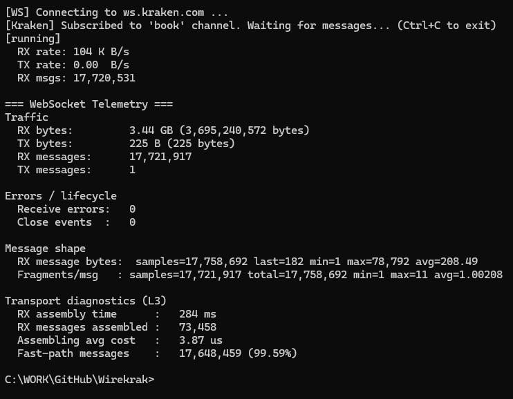

# WinHTTP WebSocket Transport Benchmark (Final)

This document records the **final long-run benchmark results** for the
WinHTTP WebSocket transport backend in Wirekrak.
The benchmark was executed continuously for approximately **10 hours**
under real Kraken book traffic to validate **stability, throughput,
fragmentation behavior, and RX path efficiency**.

---

## Test Summary

- **Backend:** WinHTTP WebSocket
- **Workload:** Kraken `book` channel (high-volume instruments)

    - "BTC/USD", "BTC/EUR", "ETH/USD", "ETH/EUR", "SOL/USD", "XRP/USD", "ADA/USD", "DOGE/USD", "AVAX/USD", "LINK/USD", "DOT/USD", "MATIC/USD", "LTC/USD"

- **Receive buffer:** 8 KB
- **Callback API:** `std::string_view` (zero-copy fast path)
- **Telemetry level:** L3 (transport diagnostics enabled)
- **Duration:** ~10 hours

---

## Traffic

- **RX bytes:** 3.44 GB (3,695,240,572 bytes)
- **TX bytes:** 225 bytes
- **RX messages:** 17,721,917
- **TX messages:** 1

Average sustained RX rate during the run was approximately **100–110 KB/s**,
representing realistic, continuous market data load rather than synthetic bursts.

---

## Errors & Lifecycle

- **Receive errors:** 0
- **Close events:** 0

The WebSocket connection remained stable for the entire duration with no
disconnects, retries, or error conditions.

---

## Message Shape

- **Average message size:** ~208 bytes
- **Minimum size:** 1 byte
- **Maximum size:** ~78 KB
- **Fragments per message (avg):** 1.002
- **Maximum fragments observed:** 11

Most messages are small incremental updates. Fragmentation occurs only
for large snapshot or batched messages.

---

## RX Path Efficiency

- **Fast-path messages:** 17,648,459 (99.59%)
- **Messages requiring assembly:** 73,458 (0.41%)

The vast majority of messages are delivered through the zero-copy fast path
without requiring message assembly.

---

## Assembly Cost

- **Total RX assembly time:** 284 ms
- **Messages assembled:** 73,458
- **Average assembly cost:** ~3.87 µs per assembled message

Total time spent assembling fragmented messages over the entire 10-hour run
is negligible, confirming that fragmentation handling does not materially
impact throughput.

---

## Conclusions

- The WinHTTP WebSocket transport is **stable under long-running, high-volume load**
- RX throughput is consistent and bounded by feed characteristics
- Fragmentation is rare and data-driven, not buffer-driven
- Zero-copy fast path is dominant (>99.5%)
- Assembly overhead is minimal and non-accumulative

These results validate the transport architecture and confirm that the
WebSocket layer is **not a performance bottleneck** for Kraken market data ingestion.



---

## Running the benchmark

This benchmark does not require any command-line parameters.
Results depend on network conditions and upstream feed activity.
For long-run stability tests, the benchmark can be left running for hours.

### Build

Make sure benchmarks are enabled when configuring the project:

```bash

cmake --preset ninja-release-bench

```
Then

```bash

cmake --build --preset release-bench

```

### Run (on windows example):

```bash
build\debug\benchmark\transport\winhttp_websocket_throughput.exe
```

### Behavior

- The benchmark connects to ws.kraken.com
- Subscribes to high-volume book feeds
- Runs continuously until interrupted
- Periodically prints live RX/TX rates
- Dumps a final telemetry summary on exit

Stop the benchmark with Ctrl+C.

---

## Notes

This benchmark measures **transport-level behavior only**.
Protocol parsing, order book processing, and application logic are intentionally
excluded and should be evaluated with separate benchmarks.

Results are environment-dependent and reflect the backend, configuration,
and workload used at the time of execution.

--- 
⬅️ [Back to Benchmarks README](../../README.md#transport-benchmarks)
